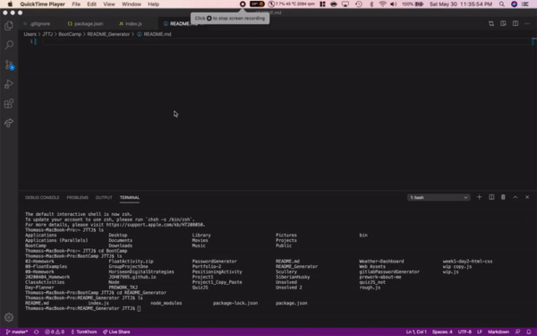

# README Generator
This application was developed by: JOH07995

A nice Command Line Interface to help you construct a README for your application. In fact, this README was generated with this app!

## Installation
Git clone or Download and unzip the repo from Github. Afterwards, you will need to run npm install.

## How to use the Application
In the terminal, it is as easy as navigating to the application folder, whether you cloned or unizpped and using node. The command is node index.js and you will be prompted with questions in which you respond to generate your README.md

## Walkthrough

## Issue Reporting and Contributing
To contirbute or report any issues with this application, please send an email to ThomasKhomJohnson@gmail.com

## Other Contibuting Developers:
none

## License(s)
MIT
